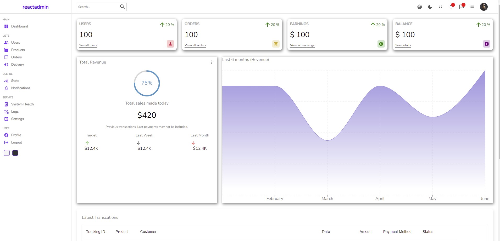

# React Admin Dashboard

### Description
This project involved creating an admin dashboard using react, react-hooks, material UI, SASS etc.
In the home page, it displays a summary of total sales with a breakdown of how many users, orders, earning ets and also shows total revenue made in that specific day. There is also a summary of latest transactions as well as details about them including amount, payments method ets.
There is also a functionality to switch from light mode to dark mode. This project was inspired courtesy of [Lama Dev on Youtube](https://www.youtube.com/c/LamaDev/videos/)

### Setup
- clone the repo then run `npm install` to install dependencies
- run `npm start` to start the server at `localhost:300`
- You can now check the various features of the application.

### Licence
Public Repository.